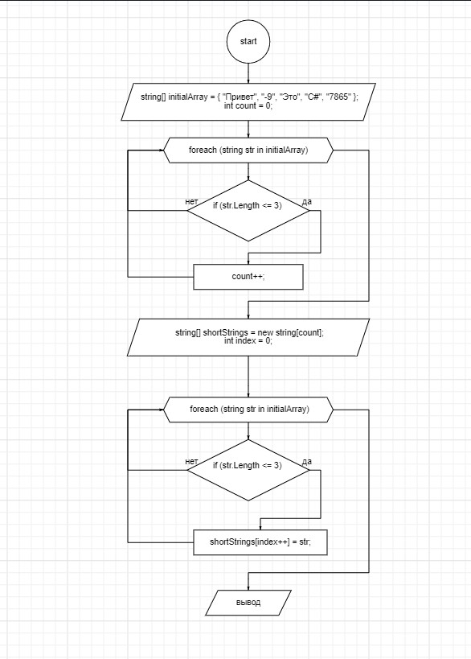
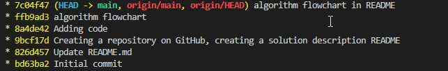

# Final_control_work
## Итоговая контрольная работа по основному блоку:
### Описание решения:
        1. Задаем исходный массив строк: string[] initialArray.

        2. Вычисляем количество строк, длина которых меньше или равна 3 символам:
        - Используем цикл foreach для обхода исходного массива.
        - Внутри цикла проверяем длину каждой строки с помощью свойства Length.
        - Если длина строки меньше или равна 3, увеличиваем счетчик count.

        3. Создаем новый массив для хранения коротких строк: string[] shortStrings.

        4. Заполняем новый массив:
        - Используем цикл foreach для обхода исходного массива.
        - Если длина строки меньше или равна 3, добавляем ее в новый массив.

        5. Выводим результат:
        - Выводим исходный массив строк.
        - Выводим новый массив строк.
# Блок схема:

# Скрин коммитов:
